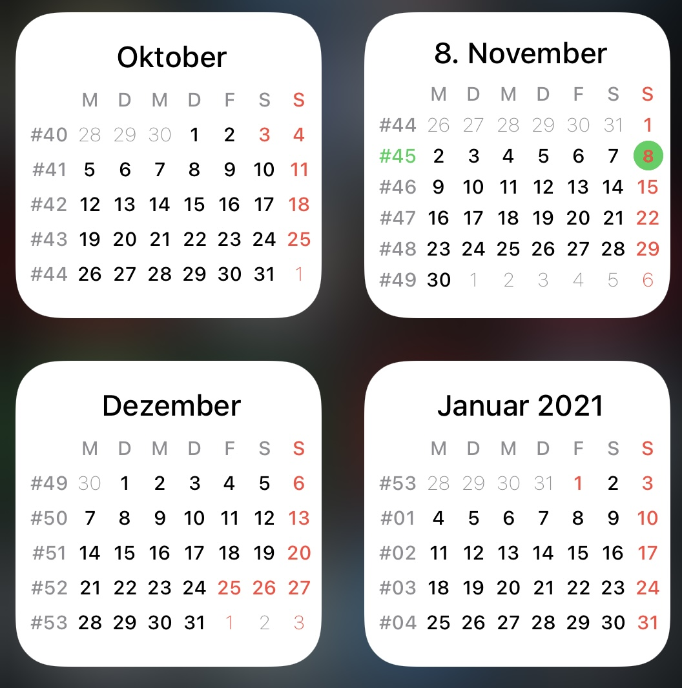
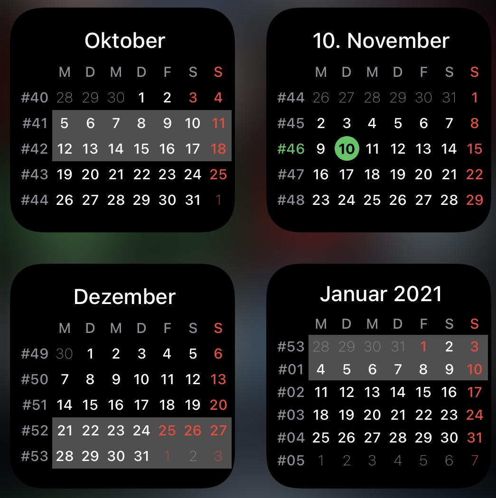

# simple-calendar
Simple calendar widget to be used in smart stacks

This is a calander widget (only small ones) which I've written for myself. 
For now (07.11.2020) it's coded quick and dirty.

With numeric parameter you can set an offset for the month.
-1 means the previous month is shown.
2 means the month after the next month is shown.
This mechanism allows multiple widget in one stack. So you can swipe through the month.

Layout is clean and simple.
There are several switches to configure the widget. (all in code, not a s parameter)
E.g. 
  * US-style (other calculation of weeks, and weeks starts on Sundays)
  * calender weeks are shown, but this can be disabled.

Widget is tested tested only a bit.

### Known Bugs

### InitialVersion (07.11.2020)

### ChangeLog
- 2020-11-08 ADD: Support of public holidays (uses feiertage-api.de). Indicated with same color as Sundays.
- 2020-11-08 CHG: Saturdays, Sundays and Holidays in next and previous month, so also get the right color, but will remain with thin font.
- 2020-11-08 FIX: Some finetuning, for today circle incl. font color
- 2020-11-09 FIX: color handling
- 2010-11-10 ADD: Support of holiday (state dependend)
