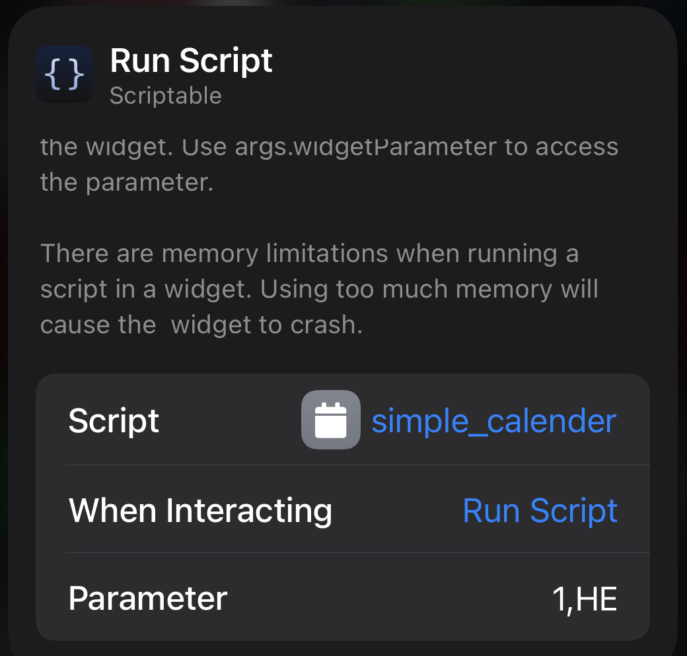
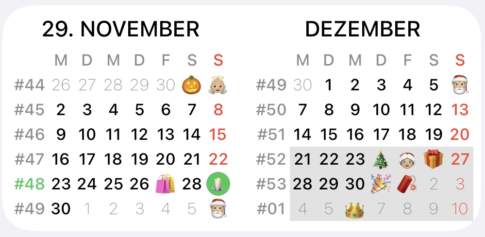
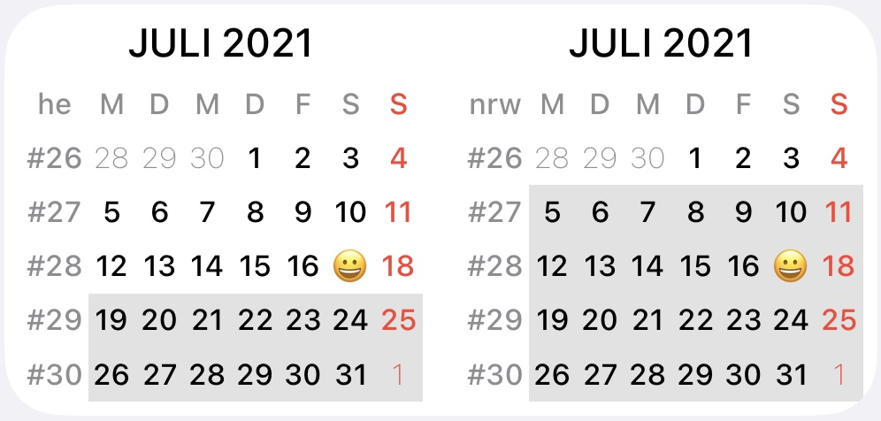
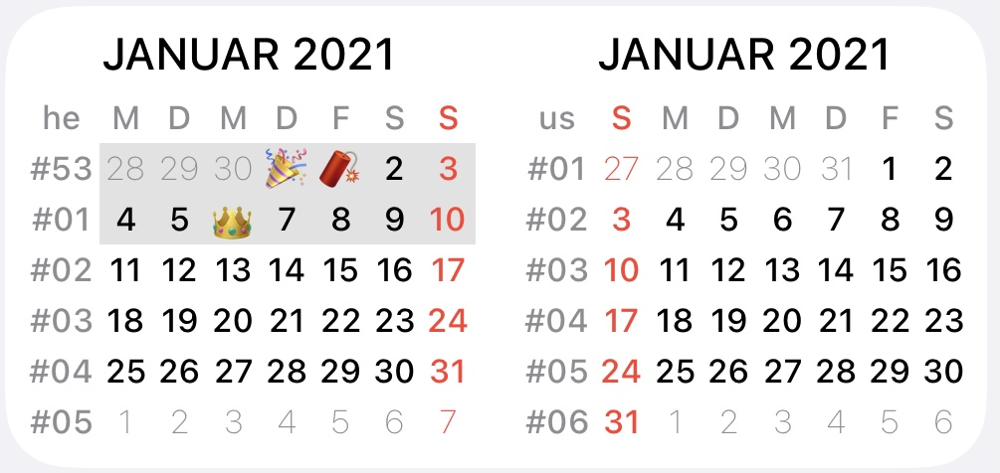

# simple-calendar
Simple calendar widget to be used in smart stacks

Layout is clean and simple.
There are several switches to configure the widget. (most of them in code, 2 important ones as widget parameter)
E.g. 
  * US-style (other calculation of weeks, and weeks starts on Sundays)
  * calender weeks are shown, but this can be disabled.
  * State (german:Bundesland) to show Public holidays (german: Feiertage) and Holidays (german: Ferien)

 

### Configuration
Most important configuration is to define the month to show and the state (if you want to see marked holidays)
Parameters have to be divided by ','
Example shows the configuration for the upcoming month, and the state Hessen

Input parameters are parsed in a flexible way, so they don't have to be 100% accurate.
Order doesn't matter. If parameters are missing, useful estimation will be done.

#### 1st (and maybe the only parameter) is the numeric offset for the month.
-1 means the previous month is shown.
2 means the month after the next month is shown.
This mechanism allows multiple widget in one stack. So you can swipe through the month.
#### 2nd parameter is state (german: Bundesland)
2-character abbreviation 
* BW = Baden-Württemberg
* BY = Bayern
* BE = Berlin
* BB = Brandenburg
* HB = Bremen
* HH = Hamburg
* HE = Hessen
* MV = Mecklenburg-Vorpommern
* NI = Niedersachsen
* NW = Nordrhein-Westfalen
* RP = Rheinland-Pfalz
* SL = Saarland
* SN = Sachsen
* ST = Sachsen-Anhalt
* SH = Schleswig-Holstein
* TH = Thüringen

* US = USA (att: special handling, calender get's US style, only public holidays are not supported)

* ??   any code, which is supported by https://date.nager.at/Home/Countries 

* FA = Persian/Farsi calendar (att: special handling, calender get's persian style, weeknumbers are not supported)

       - this code can be extend by country codes (e.g. FA-EG for Egypt)

#### 3rd, 4th parameter (used for 2nd sheet in medium widget)
e.g. 0,he,1,he

shows the current and the next month

e.g. 0,he,0,nrw

To compare different states. Useful to check different holidays

e.g. 0,he,0,us

To compare german state with USA.

As calendar weeks calculated in different ways, they are not the same in 2021.

### Known Bugs

### ChangeLog
- 2020-11-07 initial version
- 2020-11-08 ADD: Support of public holidays (uses feiertage-api.de). Indicated with same color as Sundays.
- 2020-11-08 CHG: Saturdays, Sundays and Holidays in next and previous month, so also get the right color, but will remain with thin font.
- 2020-11-08 FIX: Some finetuning, for today circle incl. font color
- 2020-11-09 FIX: color handling
- 2010-11-10 ADD: Support of holiday (state dependend)
- 2020-11-10 ADD: state (german:Bundesland) can be configured by widget parameter, no need to touch code
- 2020-11-17 CHG: increased font size, month in upper case
- 2020-11-17 ADD: to support us, you can give "us" as state (US szyle calender will be enabled in this case, and holidays will not be shown - maybe in the future, if there's a request)
- 2020-11-11 ADD: Widget get's a reasonable link (forward to web calendar which fits to your region)
- 2020-11-11 FIX: last week in month lost in some cases
- 2020-11-28 ADD: Support for large widget
- 2020-11-28 ADD: Public Holidays will be displayed as emoji (if available). If you think it_#s to colorful, you can switch this off with showHolidayIcons = false
- 2020-11-29 ADD: Support for medium widget
- 2020-12-03 ADD: Support for Persian / Farsi calendar 
- 2020-12-04 ADD: Support for international public holiday
